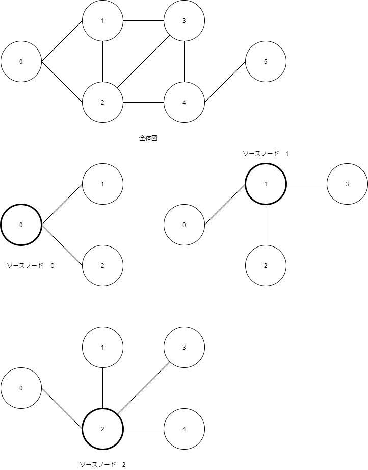

# Zone enery

## メモ

- `question36.py`は、エッジを最大化するコード
- サンプルが言う
  - 星の数１５、はノードが１５
  - 文化的交流の数２３、はエッジが２３
- `question36.py`は、エッジが最大になるループを作成したが、不正解となった
- 問題は、「3つの星を選び、最も多くの言語が習得できる組み合わせを列挙せよ」なので、文化的交流の数＝エッジの数を最大化するものと誤解釈した
- 問題の目的から、ノード（ソースノードが持つターゲットノード）の数を最大化する必要がある
- `question37.py`は以下の方針とする

## ロジック

1. 各ノードが持つターゲットノード一覧を作成する（他のノードと重複があってもよい）
   1. `'0': target_0 = [['0', '1'], ['0', '2']]`
   2. `'1': target_1 = [['1', '0'], ['1', '2'], ['1', '3']]`
   3. `'2': target_2 = [['2', '0'], ['2', '1'], ['2', '3'], ['2', '4']]`
   4. `'3': target_3 = [['3', '1'], ['3', '2'], ['3', '4']]`
   5. `'4': target_4 = [['4', '2'], ['4', '3'], ['4', '5']]`
   6. `'5': target_5 = [['5', '4']]`
2. 取得したノード一覧リスト（`get_node`とする）を宣言し、空で初期化する
   1. `get_node = []`
3. nC3 の最初のソースノードを取得する (0, )
4. 取得済みノード一覧に、ソースノード '0' のターゲットノードが含まれていない場合、これを取得済みノード一覧に追加する（最初は無条件に追加する）
   1. `get_node.append('1')`
   2. `get_node.append('2')`
   3. `get_node: [1', '2']`
5. nC3 の2番目のソースノードを取得する （0, 1, )
6. 取得済みノード一覧に、ソースノード '1' のターゲットノードが含まれていない場合、これを取得済みノード一覧に追加する
   1. `get_node.append('0')`
   2. `get_node.append('3')`
   3. `get_node: [1', '2', '0', '3']`
7. nC3 の3番目のノードを取得する （0, 1, 2)
8. 取得済みノード一覧に、ソースノード '2' のターゲットノードが含まれていない場合、これを取得済みノード一覧に追加する
   1. `get_node.append('4')`
   2. `get_node: [1', '2', '0', '3', '4']`
9. 取得済みノード一覧に含まれるノードの数を数える
   1. `len(get_node): 5 （選択したノード3個を含む）`
10. 上記の処理を nC3 買い繰り返し、`len(get_node)`の最大値を求める（最大値が解答）

- 下図の場合

ソースノード | ターゲットノード一覧 | get_node (初期値) | get_node (ターゲットノード追加後)
------|--------------------|-----------------|---------------------
 0 | 1, 2 | [] | [1, 2]
 1 | 0, 2, 3 | [1, 2] | [1, 2, 0, 3]
 2 | 0, 1, 3, 4 | [1, 2, 0, 3] | [1, 2, 0, 3, 4]

